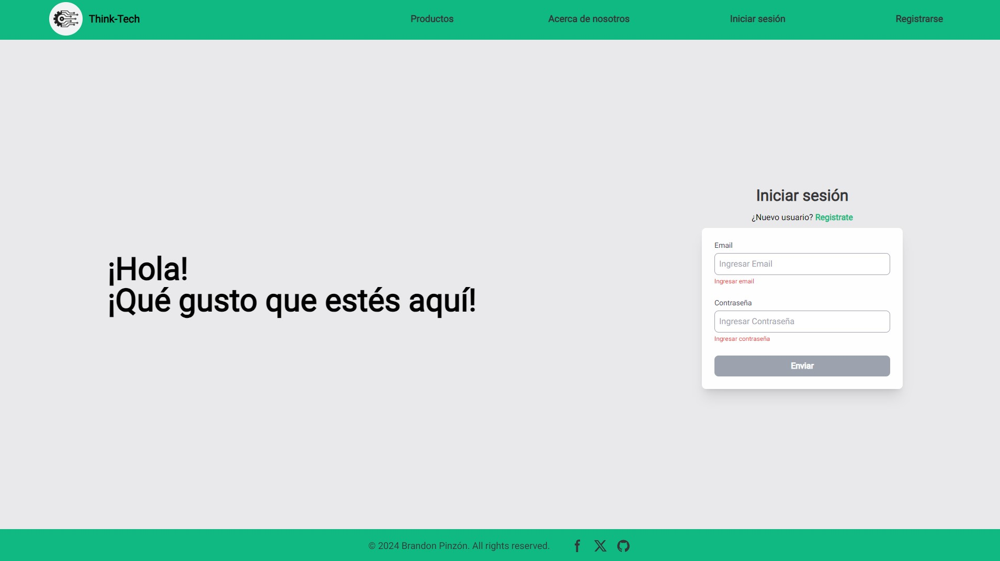
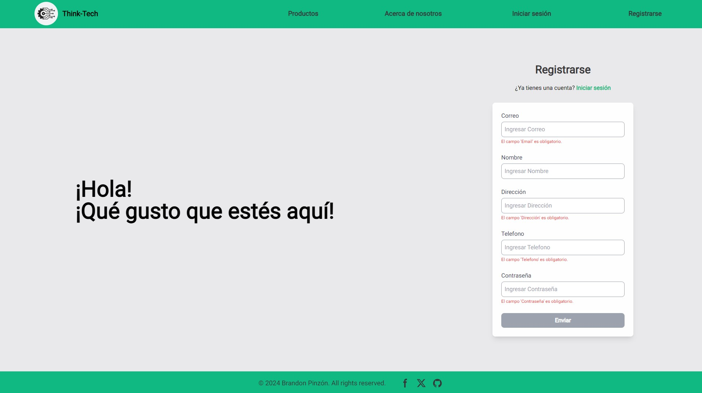
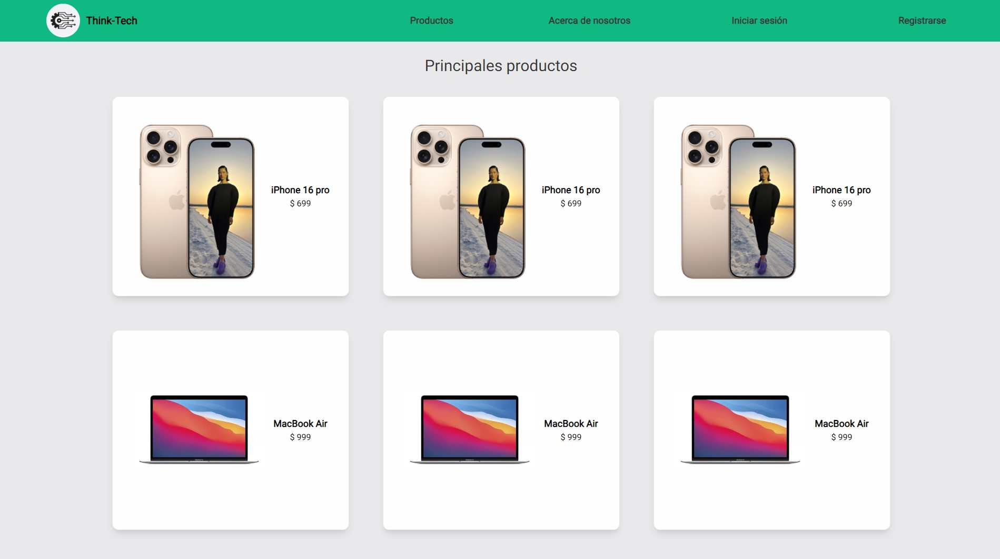
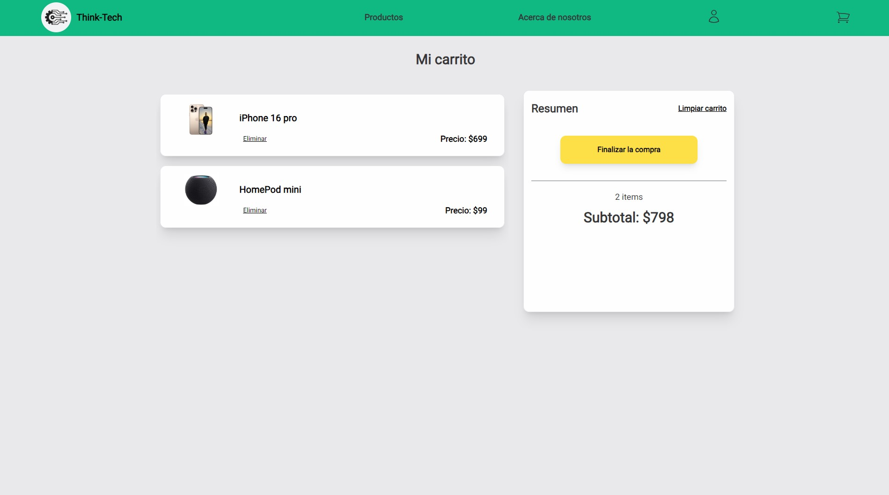

  <h1 align="center">
  Think-Tech
  </h1>
  <h3> Proyecto desarrollado durante el bootcamp de SoyHenry
  </h3>

 
 

  

  Este proyecto fue uno de los desafios que enfrenté durante el bootcamp de SoyHenry, donde tuve que desarrollar el front end de un e-commerce utilizando Next.js. El proyecto consiste en una tienda en línea de dispositivos tecnológicos como celulares, portátiles, audifonos, entre otros, donde los usuarios pueden registrarse, iniciar sesión y luego de iniciar sesión, pueden agregar los productos a un carrito. El carrito muestra los productos, el precio total, la cantidad de items agregados y tambien se puede eliminar los items del carrito.
  

  
El carrito mantiene los productos incluso después de cerrar sesión para visualizarlos al voler a ingresar.

  
  

  
  

<h2 align="center">
  Tecnologías que usé
  </h2>

 
 
  <h3>
    Conectemos 🤝
  </h3>

  
  
  
✉ brandonpinzont@gmail.com 

